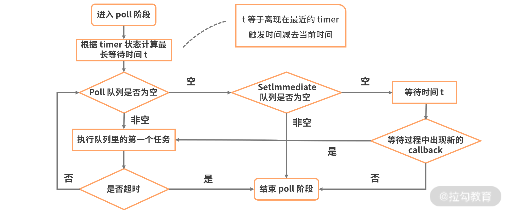

# 浏览器环境

栈中放主代码，事件队列中放任务（宏任务和微任务）

## 概述

JS 分为同步任务和异步任务<br>
同步任务都在 JS 引擎线程上执行，形成一个执行栈<br>
事件触发线程管理一个任务队列，异步任务触发条件达成（比如 setTimeout 达到设定的时间），将回调事件放到任务队列中<br>
执行栈中所有同步任务执行完毕，此时 JS 引擎线程空闲，系统会读取任务队列，将可运行的异步任务回调事件添加到执行栈中，开始执行<br>

## 具体流程（以下必须在 16.7ms 完成，否则就会丢帧、卡顿）

1.  执行一个宏任务（栈中没有就从事件队列中获取）
2.  执行过程中如果遇到微任务，就将它添加到微任务的任务队列中
3.  宏任务执行完毕后，立即执行当前微任务队列中的所有微任务（依次执行）
4.  当前宏任务执行完毕，开始检查渲染，然后 GUI 线程接管渲染
5.  渲染完毕后，JS 线程继续接管，开始下一个宏任务（从事件队列中获取）

宏任务是由宿主（浏览器、Node）发起的，而微任务是由 JS 发起的。
Macrotask：主代码块（同步代码）、MessageChannel、postMessage、setTimeout、setInterval、setImmediate、I/O、UI rendering<br>
Microtask：process.nextTick、Promise.[then/catch/finally]、MutaionObserver（监听 DOM 变动的构造函数）、 queueMicrotask、Object.observe（已废弃）<br>
[Event Loop](https://juejin.im/post/5d5b4c2df265da03dd3d73e5#heading-10)

## 重绘和回流其实也和 Eventloop 有关

1.  当 Eventloop 执行完 Microtasks 后，会判断 document 是否需要更新，因为浏览器是 60Hz 的刷新率，每 16.6ms 才会更新一次。
2.  然后判断是否有 resize 或者 scroll 事件，有的话会去触发事件，所以 resize 和 scroll 事件也是至少 16ms 才会触发一次，并且自带节流功能。
3.  判断是否触发了 media query
4.  更新动画并且发送事件
5.  判断是否有全屏操作事件
6.  执行 requestAnimationFrame 回调
7.  执行 IntersectionObserver 回调，该方法用于判断元素是否可见，可以用于懒加载上，但是兼容性不好
8.  更新界面
9.  以上就是一帧中可能会做的事情。如果在一帧中有空闲时间，就会去执行 requestIdleCallback 回调。

# Node.js

在一个 I/O 循环内：setImmediate 总是优先于 setTimeout(callback ,0)<br>
主模块：setImmediate 和 setTimeout(callback ,0) 顺序就不一定了。
Node 中 MicroTask 会在每个事件循环阶段执行前执行（process.nextTick 和 Promise）。
process.nextTick 会在每个阶段完成后，如果存在 nextTick 队列，就会清空队列中的所有回调函数，并且优先于其他 microtask 执行。

## 事件循环的 6 个阶段

```
// 每个事件循环都有6个阶段（Macrotask），每个阶段都会维持一个先进先出的可执行回调函数队列。
// 然后执行这个阶段队列中的回调函数直到队列为空，或者回调函数调用次数达到上限，事件循环会进入下一个阶段。
// 在事件循环的每次运行之间，Node.js检查它是否在等待任何异步I/O或定时器，如果没有，则彻底关闭。
// process.nextTick、promise.then 会在下面6个阶段执行完的间隙中执行微任务
1.  timers 执行setTimeout() 和 setInterval()中到期的callback。
2.  I/O callbacks 这个阶段主要执行系统级别的回调函数，比如 TCP 连接失败的回调。
3.  idle，prepare（libuv内部使用）
4.  poll (轮询阶段)是一个重要且复杂的阶段，几乎所有 I/O 相关的回调，都在这个阶段执行（除了setTimeout、setInterval、setImmediate 以及一些因为 exception 意外关闭产生的回调）
    如果轮询队列不是空的 ，则执行它们。
    如果轮询队列为空，则进行下列操作。
      有到达时间阈值的 setTimeout，则回到 timers阶段。
      如有 setImmediate 则进入 check 阶段。
5.  check 执行 setImmediate() 设定的 callbacks。
6.  close callbacks 执行关闭请求的回调函数，比如 socket.on('close', ...)。
```

浏览器端任务队列每轮事件循环仅出队一个回调函数接着去执行微任务队列；而 Node.js 端只要轮到执行某个宏任务队列，则会执行完队列中所有的当前任务，但是当前轮次新添加到队尾的任务则会等到下一轮次才会执行。<br>
poll 阶段

[event-loop-timers-and-nexttick](https://nodejs.org/zh-cn/docs/guides/event-loop-timers-and-nexttick/)<br>
microtask 会在事件循环的各个阶段之间执行<br>
[Node.js 指南（Node.js 事件循环、定时器和 process.nextTick()）](https://segmentfault.com/a/1190000017017364)

## process.nextTick() vs setImmediate()

process.nextTick()在同一个阶段执行<br>
setImmediate()在事件循环的下一个阶段或者'tick'中执行<br>
process.nextTick 总是在剩余代码执行之后事件循环继续之前执行回调函数<br>

同一次事件循环执行顺序<br>
<br>
process.nextTick 总是在剩余代码执行之后事件循环继续之前执行回调函数<br>

## 异步任务分两种

本轮循环：promise.nextTick、promise.then 的回调函数<br>
次轮循环：setTimeout、setInteval、setImmediate 的回调函数<br>

[Node.js 中的事件循环](https://www.jianshu.com/p/8cab6821bab7)

# 总结

浏览器环境下，microtask 的任务队列是每个 macrotask 执行完之后执行。而在 Node.js 中，microtask 会在事件循环的各个阶段之间执行，也就是一个阶段执行完毕，就会去执行 microtask 队列的任务。


## node.js 中

在同一个 I/O 循环优先级如下：process.nextTick > promise.then > setImmediate > setTimeout(callback, 0)<br>
在主模块中 process.nextTick 仍优先于 promise.then。<br>
在主模块中 setImmediate 和 setTimeout(fn, 0) 顺序不定，由线程决定。
