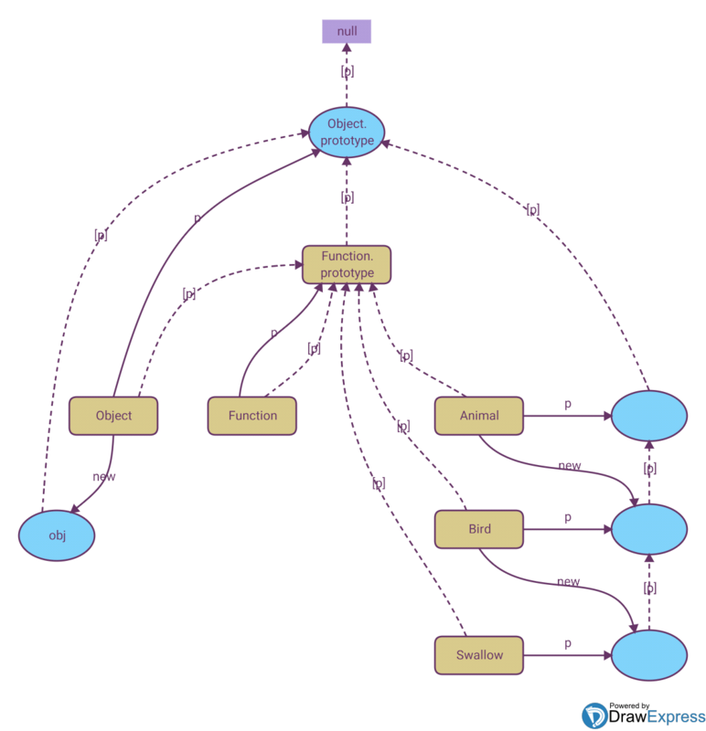

# 描述 JS 中基本概念

## Execution context(EC)

执行上下文(简称-EC)是 ECMA-262 标准里的一个抽象概念<br>
代码运行前会创建一个唯一的全居执行上下文，执行函数时会创建一个函数执行上下文<br>
执行上下文分为三种：(全局执行上下文，函数执行上下文，eval()执行上下文)<br>
执行上下文的代码被分成两个基本的阶段来处理：进入执行上下文和执行代码（下面的理论基础）<br>
eval 会使用全局变量对象或调用者的变量对象(eval 的调用来源)。<br>

### Execution context 的组成

EC 由 3 部分组成：VO、this 指针、Scope
变量对象（VO）：arguments、variables、functions 声明（function 表达式不参与 VO）<br>
[[Scope]]属性：指向作用域链。<br>
this 指针：指向一个环境对象，this 的值只取决于进入上下文时的情况。<br>

```
// 如一个函数的执行上下文模拟表示
activeExecutionContext = {
    VO: {...}, // or AO
    this: thisValue,
    Scope: [ // Scope chain
      // 所有变量对象的列表
      // for identifiers lookup
    ]
};
```

### Execution context stack(ECS)

执行环境栈(执行上下文栈)<br>
堆栈底部永远都是全局上下文(global context)，而顶部就是当前(活动的)执行上下文，堆栈在 EC 类型进入和退出上下文的时候被修改（推入或弹出），当进入 funtion 函数代码(所有类型的 funtions)的时候，ECStack 被压入新元素，直到该函数 return 则当前 EC 被弹出。
一个抛出的异常如果没被截获的话也有可能从一个或多个执行上下文退出。<br>

```
// 模拟ECS（用栈来表示最好不过了）
// 最原始的
ECStack = [];
// 加载代码
ECStack = [globalContext];
// 进入函数 foo（嵌套函数、递归同样的方式压入栈和弹出栈）
ECStack = [<foo> functionContext, globalContext];
// 推出函数 foo
ECStack = [globalContext];
```

[深入理解 JavaScript 系列（11）：执行上下文（Execution Contexts）](https://www.cnblogs.com/TomXu/archive/2012/01/13/2308101.html)

## VO 对象（Variable Object）

VO 分为全局上下文 VO（全局对象，Global object)和函数上下文的 AO。<br>
变量对象在每次进入上下文时创建，并填入初始值，值的更新出现在代码执行阶段。<br>
变量对象是规范上的或者说是引擎实现上的，不可在 JavaScript 环境中访问，只有到当进入一个执行上下文中，这个执行上下文的变量对象才会被激活，所以才叫 activation object。<br>
VO 和 AO 可以看作它们是同一个对象，只是处于执行环境的不同生命周期。<br>
函数表达式 FE 不影响 VO。<br>

```
// 函数声明FD
function a() {}
// 函数表达式FE
var a = function() {}
```

[深入理解 JavaScript 系列（12）：变量对象（Variable Object）](https://www.cnblogs.com/TomXu/archive/2012/01/16/2309728.html)

## AO 对象加载顺序（函数预编译 Activation Object）

活动对象是在进入函数上下文时刻被创建的，它通过函数的 arguments 属性初始化。<br>

1.  函数声明时创建一个 AO 对象，默认放入 arguments 对象（此时为 undefined）
2.  将函数声明的形参和变量声明放入 AO 对象，其值为 undefined（参数相当于局部变量）
3.  将形参和实参进行统一
4.  将所有的函数声明放入 AO 对象，其值为函数体
5.  开始逐步执行函数，之前的 arguments 赋值为 Arguments 对象（后面说明）

PS：1-4 步为进入执行上下文，第 5 步开始执行代码

```
function parent(a, b){
	console.log(a);
	var c = 123;
	console.log(c);
	function a(){};
	console.log(b);
	var b = function c(){};
	console.log(b)
}
test(1, 3);
// 写出对应的输出值
// 根据AO对象加载顺序，分析AO对象变化
// 1
AO {arguments: undefined}
// 2
AO {arguments: undefined, a: undefined, b: undefined, c: undefined}
// 3
AO {arguments: undefined, a: 1, b: 3, c: undefined}
// 4
AO {arguments: undefined, a: function a, b: 3, c: function c, }
// 执行函数过程AO变化
// var c = 123;
AO {arguments: Arguments对象, a: function a, b: 3, c: 123, }
// var b = function c(){}
AO {arguments: Arguments对象, a: function a, b: function c, c: 123, }
// 输出结果
function a
123
3
function c
```

## Arguments 对象是活动对象的一个属性，它包括如下属性：

callee — 指向当前函数的引用
length — 真正传递的参数个数
properties-indexes (字符串类型的整数) 属性的值就是函数的参数值(按参数列表从左到右排列)。 properties-indexes 内部元素的个数等于 arguments.length。
properties-indexes 的值和实际传递进来的参数之间是共享的。

## GO 对象加载顺序（预编译）

1.  创建一个 GO 对象
2.  变量声明放入 GO 对象，其值为 undefined
3.  将所有的函数声明放入 AO 对象，其值为函数体
4.  开始逐行执行（为变量赋值）

```
function a() {
  function b() {
    var bb = 234;
  }
  var aa = 123;
  b();
}
console.log(glob); // function glob
var glob = 100;
console.log(glob); // 100
function glob() {}
console.log(glob); // 100
a()

// 分析GO对象变化
// 1
GO {}
// 2
GO {glob:undefined}
// 3
GO {glob: function glob}
// 执行到第一个console.log(glob);
GO {glob: function glob}
// 执行到第二三个console.log(glob);
GO {glob: 100}
```

## 函数的[[Scope]]属性

[[scope]]在函数创建时被存储－－静态（不变的），永远永远，直至函数销毁。即：函数可以永不调用，但[[scope]]属性已经写入，并存储在函数对象中。<br>
EC.scope 和 函数的[[scope]]区别，EC.scope = VO|AO + 函数的[[scope]];<br>
函数的[[scope]] === 声明时所有能访问到的 VO 对象（父 EC 的 VO 到 GO）；前面两者就形成了 Scope Chain。

## Scope Chain

作用域链是内部上下文所有变量对象（包括父变量对象）的列表。<br>
注意：with 和 catch 可以改变作用域链，将 with(obj)中的 obj 或 catch(error)中的 error 放在作用域链最前面。<br>

```
var x = 10;
function foo() {
  var y = 20;
  function bar() {
    var z = 30;
    alert(x +  y + z);
  }
  bar();
}
foo(); // 60

// 全局上下文的变量对象
globalContext.VO === GO {
  x: 10,
  foo: <reference to function foo>
};
// 在foo创建时
foo.[[scope]] = [globalContext.VO];
// 当foo激活时（进入上下文）
fooContext.AO = {
  y: 20,
  bar: <reference to function bar>
};
// foo上下文的作用域链
fooContext.Scope = fooContext.AO + foo.[[Scope]];
fooContext.Scope = [fooContext.AO, globalContext.VO];

// bar创建时
bar.[[scope]]= [fooContext.AO, globalContext.VO];
// bar激活时（进入上下文）
barContext.AO = {
  z: 30
};
// bar上下文的作用域链
barContext.[[scope]] = barContext.AO + bar.[[scope]];
barContext.[[scope]] = [barContext.AO, fooContext.AO, globalContext.VO];
```

[javascript 执行环境，变量对象，作用域链](https://segmentfault.com/a/1190000000533094)
[JS 执行环境、作用域链、活动对象](https://segmentfault.com/a/1190000015782315)

# 原型链

## 一张图


图中 p 指 prototype 属性<br>
图中 c 指 constructor 属性(没画出来)<br>
图中[p]，即**proto**，指对象的原型<br>

## 总结

实例的（**proto**属性或内部[[Prototype]]属性） === 构造函数的 prototype<br>
实例的 constructor 属性 === 构造函数

```
function Animal () {}
var cat = new Animal();
cat.__proto__ === Animal.prototype // true
Animal.__proto__ === Function.prototype // true 所有函数都是Function的实例
Object.prototype.__proto__ === null; // 原型链的终点
```

## 相关 API

```
a instanceof A // 实例a的原型链（__proto__）是否存在构造函数A的prototype属性
cat instanceof Animal // true
Animal instanceof Function // true

Reflect.setPrototypeOf(obj, prototype) or Object.setPrototypeOf(obj, prototype) // 设置一个指定的对象的原型 ( 即, 内部[[Prototype]]属性）到另一个对象或  null。

Reflect.getPrototypeOf(object) or Object.getPrototypeOf(object) // 返回指定对象的原型（内部[[Prototype]]属性的值）。

Object.create(proto[, propertiesObject]) // 创建一个新对象，使用现有的对象来提供新创建的对象的__proto__。
```

# 装箱和拆箱

装箱转换：把基本类型转换为对应的包装类型。
拆箱操作：把对应的包装类型转换为基本类型。

```
var s1 = "some text";
var s2 = s1.substring(2);
// 拆分为下列步骤
（1）操作之前创建String类型的一个实例；（装箱）
（2）操作时在实例上调用指定的方法（可从原型链上拿到对应的方法和属性）；
（3）操作结束后销毁这个实例；（拆箱）
// 手动拆箱
通过包装类型的valueOf()或者toString()
var numberObj = new Number(1);
typeof numberObj // object
typeof numberObj.valueOf() // number
typeof numberObj.toString() // string
```

# 相等和全等操作符

## 全等运算符===（IEA 规则）

1.  如果两个操作数有不同的类型，它们不是严格相等的
2.  如果两个操作数都为 null，则它们是严格相等的
3.  如果两个操作数都为 undefined，它们是严格相等的
4.  如果一个或两个操作数都是 NaN，它们就不是严格相等的
5.  如果两个操作数都为 true 或都为 false，它们是严格相等的
6.  如果两个操作数都是 number 类型并且具有相同的值，则它们是严格相等的
7.  如果两个操作数都是 string 类型并且具有相同的值，则它们是严格相等的
8.  如果两个操作数都引用相同的对象或函数，则它们是严格相等的
9.  以上所有其他情况下操作数都不是严格相等的。

## 对象转换为原始值的规则

### 对象到布尔值

所有的对象（包括数字和函数包装类型对象）都转换为 true。<br>

### 对象到字符串（ OPCA 算法）

1.  如果方法 valueOf() 存在，则调用它。如果 valueOf() 返回一个原始值，JS 将这个值转换为字符串（如果本身不是字符串的话），并返回这个字符串结果。
2.  如果方法 toString() 存在，则调用它。如果 toString() 返回一个原始值，JS 将这个值转换为字符串（如果本身不是字符串的话），并返回这个字符串结果。需要注意，原始值到字符串的转换。
3.  否则，JS 无法从 toString() 或 valueOf() 获得一个原始值,它将抛出一个 TypeError:不能将对象转换为原始值 异常
    PS:Undefined、Null、Boolean、Number、String、Symbol、BigInt
    各种对象转换规则

```
// 通过valueOf方法不能得到原始值，则再调用toString方法
String({}) // "[object Object]"
String(['s','d']) // "s,d" 以逗号分割的字符串

// 通过valueOf方法直接得到原始值
var strObj = new String('sdf');
strObj.valueOf() // 'sdf'
var numObj = new Number(123);
numObj.valueOf() // 123
var bolObj = new Boolean(false);
bolObj.valueOf() // false
```

### 相等运算符算法(EEA 规则)

1.  如果操作数具有相同的类型，请使用上面的 IEA 测试它们是否严格相等。 如果它们不严格相等，则它们不相等，否则相等。
2.  如果操作数有不同的类型：

```
2.1） 如果一个操作数为 null 而另一个 undefined，则它们相等
2.2） 如果一个值是数字，另一个是字符串，先将字符串转换为数字，然后使用转换后的值比较
2.3） 如果一个操作数是布尔值，则将 true 转换为 1，将 false 转换为 0，然后使用转换后的值比较
2.4） 如果一个操作数是一个对象，而另一个操作数是一个数字或字符串，则使用OPCA将该对象转换为原始值，再使用转换后的值比较
```

3.  在以上的其他情况下，操作数都不相等

### 常用判定规则（==）

1.  有!运算符时，只有当 0, ‘’, false, NaN, null, undefined 为 Falsy，其余全为 truthy（由于!运算优先级高于 == ）
2.  再进行 EEA 规则判定

### 例如，new Map() == true 分享过程

1. 左边分析：由于 Map 非原始类型， map.valueOf() 不能得到原始值，map.toString() // 自身没有该方法，从 Object 上继承，左边为'[object Map]'
2. 右边分析：true 转换为 Number 即为 1，一边为数字则另一边也应该转化为数字（左边转化为 NaN）
3. NaN == 1，所以返回 false

试一试

```
[] == ![] // true，提示!的优先级高于==，![]首先会被转换为false
[''] == '' // true
'' == 0 // true

[] === [] // false
[] == [] // false
true == {} // false
true == !{} // false
'[object Object]' == {} // true
NaN === NaN // false
new Map() == true // false
```

[彻底终结 Javascript 背后的隐式类型转换](https://github.com/chunpu/blog/issues/104)
[JS 中相等和全等操作符](https://juejin.im/post/5d9fc461f265da5b5f757830)
[你真的掌握变量和类型了吗](https://mp.weixin.qq.com/s/uuqYAgn6-dZWPQahnZXJkA)

# 元编程（metaprogramming）

## 定义

元编程的目的是操作其他的程序（或自身）作为它自身的数据，或者在运行时完成它本应该在编译时应该完成的任务。<br>
反射：一门语言同时也是自身的元语言的能力称之为反射。

## JS 中的元编程

Proxy 和 Reflect 和 eval 和 new Function() 具备元编程能力。<br>
JavaScript 获得了 Proxy 和 Reflect 对象的支持，允许你拦截并定义基本语言操作的自定义行为（例如，属性查找，赋值，枚举，函数调用等）。借助这两个对象，你可以在 JavaScript 元级别进行编程。

# 闭包

## 定义

函数与对其状态即词法环境（lexical environment）的引用共同构成闭包（closure）。也就是说，闭包可以让你从内部函数访问外部函数作用域。在 JavaScript，函数在每次创建时生成闭包。

## 原理

```
function A() {
  let aVar = 1;
  return function B() {
    ++aVar;
    console.log(aVar); // 2
  }
}
A()(); // console.log(2);
```

以上面例子来说，为什么函数 A 已经弹出调用栈了，为什么函数 B 还能引用到函数 A 中的变量。因为内部函数 B 存在对 外部函数 A 中内部变量的应用，使得该变量 aVar 发生逃逸（即不跟随 A 函数的出栈而销毁）。</br>
