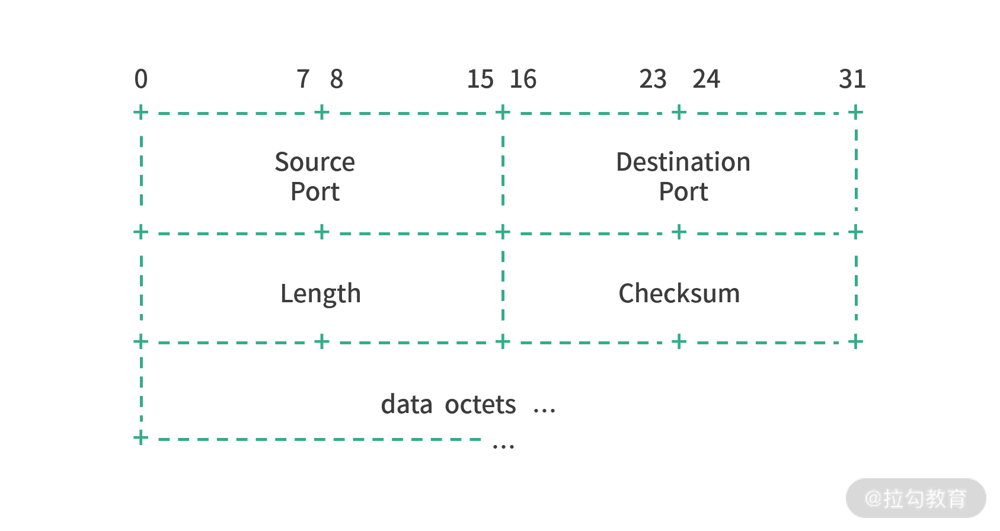
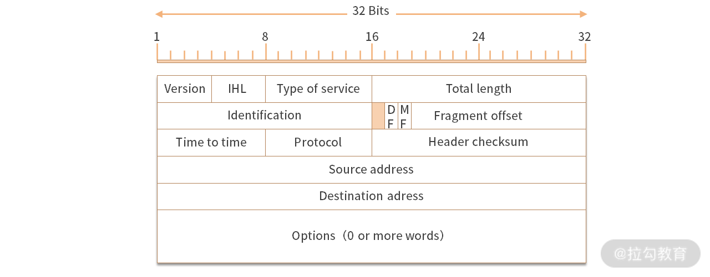

# 大纲


##  TCP/IP 5层协议
```
应用层：应用到应用（Application-To-Application）的协议。
传输层：主机到主机（Host-To-Host）的协议（port）。
网络层：ip到ip（Address-To-Address）。
数据链路层：ARP是网络层的协议,但是它所工作的内容是链路层的。
物理层：
```

# TCP(Transport Control Protocol)
TCP（Transport Control Protocol）是一个传输层协议，提供 Host-To-Host 数据的可靠传输，支持全双工，是一个连接导向的协议（Connection -oriented Protocol）。
##  什么是可靠性？
可靠性指数据保证无损传输。

##  建立连接的过程（3 次握手）

```
1.  客户端发消息给服务端（SYN）(一次🤝)
2.  服务端准备好进行连接
3.  服务端针对客户端的 SYN 给一个 ACK
4.  服务端发送一个 SYN 给客户端(二次🤝)
5.  客户端准备就绪
6.  客户端给服务端发送一个 ACK(三次🤝)
```
##  断开连接的过程（4 次挥手）

```
1.  客户端要求断开连接，发送一个断开的请求，这个叫作（FIN）。
2.  服务端收到请求，然后给客户端一个 ACK，作为 FIN 的响应。
3.  这里你需要思考一个问题，可不可以像握手那样马上传 FIN 回去？
其实这个时候服务端不能马上传 FIN，因为断开连接要处理的问题比较多，比如说服务端可能还有发送出去的消息没有得到 ACK；也有可能服务端自己有资源要释放。
因此断开连接不能像握手那样操作——将两条消息合并。所以，服务端经过一个等待，确定可以关闭连接了，再发一条 FIN 给客户端。
4.  客户端收到服务端的 FIN，同时客户端也可能有自己的事情需要处理完，比如客户端有发送给服务端没有收到 ACK 的请求，客户端自己处理完成后，再给服务端发送一个 ACK。
```
##  TCP 的封包格式

```
TCP 协议就是依靠每一个 TCP 段工作的，所以你每认识一个 TCP 的能力，几乎都会找到在 TCP Segment 中与之对应的字段。
1.  Source Port/Destination Port 描述的是发送端口号和目标端口号，代表发送数据的应用程序和接收数据的应用程序。比如 80 往往代表 HTTP 服务，22 往往是 SSH 服务……
2.  Sequence Number 和 Achnowledgment Number 是保证可靠性的两个关键。
3.  Data Offset 是一个偏移量。这个量存在的原因是 TCP Header 部分的长度是可变的，因此需要一个数值来描述数据从哪个字节开始。
4.  Reserved 是很多协议设计会保留的一个区域，用于日后扩展能力。
5.  URG/ACK/PSH/RST/SYN/FIN 是几个标志位，用于描述 TCP 段的行为。也就是一个 TCP 封包到底是做什么用的？
  URG 代表这是一个紧急数据，比如远程操作的时候，用户按下了 Ctrl+C，要求终止程序，这种请求需要紧急处理。
  ACK 代表响应，所有的消息都必须有 ACK，这是 TCP 协议确保稳定性的一环。
  PSH 代表数据推送，也就是在传输数据的意思。
  SYN 同步请求，也就是申请握手(Synchroniation)。
  FIN 终止请求，也就是挥手(Finish)。
6.  Window 也是 TCP 保证稳定性并进行流量控制的工具。
7.  Checksum 是校验和，用于校验 TCP 段有没有损坏。
8.  Urgent Pointer 指向最后一个紧急数据的序号（Sequence Number）。它存在的原因是：有时候紧急数据是连续的很多个段，所以需要提前告诉接收方进行准备。
9.  Options 中存储了一些可选字段，比如 MSS（Maxiumun Segment Size）。
  MSS：Maximum Segment Size，TCP一次传输发送的最大数据段长度。
10. Padding 存在的意义是因为 Options 的长度不固定，需要 Pading 进行对齐。
  RTT：Round-Trip Time，往返时延，表示从发送端发送数据开始，到发送端收到来自接收端的确认（接收端收到数据后便立即发送确认），总共经历的时延。
```
### Sequence Number 和 Acknowledgement Number
Acknowledgement Number，发送方已经接收了多少数据。
发送字节数和接收字节数，这个二元组的唯一性保证顺序。
注意，无论 Seq 还是 ACK，都是针对“对方”而言的。是对方发送的数据和对方接收到的数据。
### Maxiumun Segment Size
TCP一次传输发送的最大数据段长度。
```
MMS过大，带来的问题？
1.  资源的占用。一个用户占用服务器太多的资源，意味着其他的用户就需要等待或者降低他们的服务质量。
2.  支持 TCP 协议工作的 IP 协议，工作效率会下降(TCP 协议不肯拆包，IP 协议就需要拆出大量的包)，因为在网络中，每次能够传输的数据不可能太大，这受限于具体的网络传输设备，也就是物理特性。
MMS过小，带来的问题？
1.  MSS 太小的情况下，会浪费传输资源（降低吞吐量）。因为数据被拆分之后，每一份数据都要增加一个头部。如果 MSS 太小，那头部的数据占比会上升，这让吞吐量成为一个灾难。

```

##  TCP 的拆包和粘包
```
TCP 段（TCP Segment）：TCP 协议，会将数据拆分成不超过缓冲区大小的一个个部分（TCP Segment大小参考发送和接收方缓冲区大小）。
拆包：数据经过拆分，然后传输，然后在目的地重组，俗称拆包。所以拆包是将数据拆分成多个 TCP 段传输。
粘包：如果发往一个目的地的多个数据太小了，为了防止多次发送占用资源，TCP 协议有可能将它们合并成一个 TCP 段发送，在目的地再还原成多个数据，这个过程俗称粘包。所以粘包是将多个数据合并成一个 TCP 段发送。
```
##  TCP 的稳定性(滑动窗口和流速控制)
TCP 作为一个传输层协议，最核心的能力是传输。传输需要保证可靠性，还需要控制流速，这两个核心能力均由滑动窗口提供。
### 滑动窗口（Sliding Window）

```
深绿色代表已经收到 ACK 的段
浅绿色代表发送了，但是没有收到 ACK 的段
白色代表没有发送的段
紫色代表暂时不能发送的段
```

### 窗口大小的单位是？
为了简化上面所有的图片中，窗口大小是 TCP 段的数量。实际操作中，每个 TCP 段的大小不同，限制数量会让接收方的缓冲区不好操作，因此实际操作中窗口大小单位是字节数。

### 流速控制（通过发送放和接收方协商滑动窗口来控制）
发送、接收窗口的大小可以用来控制 TCP 协议的流速。窗口越大，同时可以发送、接收的数据就越多，支持的吞吐量也就越大。
当然，窗口越大，如果数据发生错误，损失也就越大，因为需要重传越多的数据。

### 超时重传
如果发送过程中，部分数据在一定时间内没能收到 ACK ，这就会触发超时重传。

### 快速重传
在 TCP 协议中，如果接收方想丢弃某个段，可以选择不发 ACK。发送端超时后，会重发这个 TCP 段。而有时候，接收方希望催促发送方尽快补发某个 TCP 段，这个时候可以使用快速重传能力。
例如段 1、段 2、段 4 到了，但是段 3 没有到。 接收方可以发送多次段 3 的 ACK。如果发送方收到多个段 3 的 ACK，就会重发段 3。这个机制称为快速重传。这和超时重发不同，是一种催促的机制。

### TCP的四种拥塞控制算法

拥塞处理是 TCP 中作用很大的功能模块，主要通过一些算法来控制数据的传输，防止拥塞网络。
拥塞处理和流量控制不同，后者是作用于接收方，保证接收方来得及接受数据。而前者是作用于网络，防止过多的数据拥塞网络，避免出现网络负载过大的情况。
拥塞处理包括了四个算法，分别为：慢开始，拥塞避免，快速重传，快速恢复。
####  慢开始算法
慢开始算法，顾名思义，就是在传输开始时将发送窗口慢慢指数级扩大，从而避免一开始就传输大量数据导致网络拥塞。举个例子在日常下载时，我们的下载网速都是逐渐变快的。
慢开始算法步骤具体如下：

连接初始设置拥塞窗口（Congestion Window） 为 1 MSS（一个分段的最大数据量）
每过一个 RTT 就将窗口大小乘二
指数级增长肯定不能没有限制的，所以有一个阈值限制，当窗口大小大于阈值时就会启动拥塞避免算法。

####  拥塞避免算法
拥塞避免算法相比简单点，每过一个 RTT 窗口大小只加一，这样能够避免指数级增长导致网络拥塞，慢慢将大小调整到最佳值。
在传输过程中如果协议认为网络拥塞了，会马上进行以下步骤：

将阈值设为当前拥塞窗口的一半
将拥塞窗口设为 1 MSS
启动拥塞避免算法

####  快速重传 && 快速恢复
快速重传一般和快恢复一起出现。一旦接收端收到的报文出现失序的情况，接收端只会回复最后一个顺序正确的报文序号（没有 Sack 的情况下）。如果收到三个重复的 ACK，说明发送端传过去的数据对端都没有收到，此时会启动快速重传。主要算法为：
##### TCP Reno

拥塞窗口减半
将阈值设为当前拥塞窗口
进入快恢复阶段（重发对端需要的包，一旦收到一个新的 ACK 答复就退出该阶段）
使用拥塞避免算法

##### TCP New Ren 改进后的快恢复
TCP New Reno 算法改进了之前 TCP Reno 算法的缺陷。在之前，快恢复中只要收到一个新的 ACK 包，就会退出快恢复。
在 TCP New Reno 中，TCP 发送方先记下三个重复 ACK 的分段的最大序号。
假如我有一个分段数据是 1 ~ 10 这十个序号的报文，其中丢失了序号为 3 和 7 的报文，那么该分段的最大序号就是 10。发送端只会收到 ACK 序号为 3 的应答。这时候重发序号为 3 的报文，接收方顺利接收并会发送 ACK 序号为 7 的应答。这时候 TCP 知道对端是有多个包未收到，会继续发送序号为 7 的报文，接收方顺利接收并会发送 ACK 序号为 11 的应答，这时发送端认为这个分段接收端已经顺利接收，接下来会退出快恢复阶段。

##  TCP 其他
### SYN FLOOD 攻击
  SYN FLOOD 攻击：在建立连接中，任意一端掉线，TCP 都会重发 SYN 包，一般会重试五次，在建立连接中可能会遇到 SYN FLOOD 攻击。
### 为什么 A 要进入 TIME-WAIT 状态，等待 2MSL 时间后才进入 CLOSED 状态？
为了保证 B 能收到 A 的确认应答。若 A 发完确认应答后直接进入 CLOSED 状态，如果确认应答因为网络问题一直没有到达，那么会造成 B 不能正常关闭。
### ARQ 协议

自动重传请求（Automatic Repeat-reQuest，ARQ）是OSI模型中数据链路层的错误纠正协议之一。
通过确认和超时机制保证了数据的正确送达，其中包含停止等待 ARQ 和连续 ARQ 协议。
####  停止等待 ARQ
```
正常传输过程
只要 A 向 B 发送一段报文，都要停止发送并启动一个定时器，等待对端回应，在定时器时间内接收到对端应答就取消定时器并发送下一段报文。
出现错误时
1 .报文丢失或出错
在报文传输的过程中可能会出现丢包。这时候超过定时器设定的时间就会再次发送丢包的数据直到对端响应，所以需要每次都备份发送的数据。
即使报文正常的传输到对端，也可能出现在传输过程中报文出错的问题。这时候对端会抛弃该报文并等待 A 端重传。
PS：一般定时器设定的时间都会大于一个 RTT 的平均时间。
2. ACK 超时或丢失
对端传输的应答也可能出现丢失或超时的情况。那么超过定时器时间 A 端照样会重传报文。这时候 B 端收到相同序号的报文会丢弃该报文并重传应答，直到 A 端发送下一个序号的报文。
在超时的情况下也可能出现应答很迟到达，这时 A 端会判断该序号是否已经接收过，如果接收过只需要丢弃应答即可。
这个协议的缺点就是传输效率低，在良好的网络环境下每次发送报文都得等待对端的 ACK 。
```
####  连续 ARQ
```
在连续 ARQ 中，发送端拥有一个发送窗口，可以在没有收到应答的情况下持续发送窗口内的数据，这样相比停止等待 ARQ 协议来说减少了等待时间，提高了效率。
累计确认
连续 ARQ 中，接收端会持续不断收到报文。如果和停止等待 ARQ 中接收一个报文就发送一个应答一样，就太浪费资源了。通过累计确认，可以在收到多个报文以后统一回复一个应答报文。报文中的 ACK 可以用来告诉发送端这个序号之前的数据已经全部接收到了，下次请发送这个序号 + 1的数据。
但是累计确认也有一个弊端。在连续接收报文时，可能会遇到接收到序号 5 的报文后，并未接到序号 6 的报文，然而序号 7 以后的报文已经接收。遇到这种情况时，ACK 只能回复 6，这样会造成发送端重复发送数据，这种情况下可以通过 Sack 来解决。
// Sack(rfc2018)
SACK(Selective ACK)是TCP选项，它使得接收方能告诉发送方哪些报文段丢失，哪些报文段重传了，哪些报文段已经提前收到等信息。
根据这些信息TCP就可以只重传哪些真正丢失的报文段。
SACK包括了两个TCP选项，一个选项用于标识是否支持SACK，是在TCP连接建立时时发送；另一种选项则包含了具体的SACK信息。
SACK只是针对失序到达的报文段的。
https://www.rfc-editor.org/rfc/rfc2018
```

# UDP
UDP 是一个面向报文（Datagram-oriented）的协议——协议双方不需要建立连接，直接传送报文（数据）。

##  UDP 的封包格式

```
1.  Source Port 是源端口号。因为 UDP 协议的特性（不需要 ACK），因此这个字段是可以省略的。但有时候对于防火墙、代理来说，Source Port 有很重要的意义，它们需要用这个字段行过滤和路由。
2.  Destination Port 是目标端口号（这个字段不可以省略）。
3.  Length 是消息体长度。
4.  Checksum 是校验和，作用是检查封包是否出错。
5.  Data octets 就是一个字节一个字节的数据，Octet 是 8 位。
```

##  UDP 与 TCP的区别
```
1.  目的差异
  TCP 协议的核心目标是提供可靠的网络传输，而 UDP 的目标是在提供报文交换能力基础上尽可能地简化协议轻装上阵。
2.  可靠性差异
  
3.  连接 vs 无连接
  TCP 是一个面向连接的协议（Connection-oriented Protocol），传输数据必须先建立连接。 UDP 是一个无连接协议（Connection-less Protocol），数据随时都可以发送，只提供发送封包（Datagram）的能力。
4.  流控技术（Flow Control）
  TCP 使用了流控技术，UDP 没有提供类似的能力。
5.  传输速度
  UDP 协议简化，封包小，没有连接、可靠性检查等，因此单纯从传输速度上讲，UDP 更快。
6.  场景差异
```

##  场景
### TCP 场景
远程控制（SSH）
File Transfer Protocol（FTP）
邮件（SMTP、IMAP）等
点对点文件传出（微信等）
### UDP 场景
网络游戏
音视频传输
DNS
Ping
直播

# IP协议

```
IP 协议（Internet Protocol）是一个处于垄断地位的网络层协议，IP协议 为传输层提供 Host-To-Host 的能力。
IP 协议并不负责数据的可靠性，IP 协议上层的传输层协议会对数据进行一次拆分，IP 协议还会进一步进行拆分。进行两次拆分是为了适配底层的设备。
IP 协议需要处理的问题：延迟、吞吐量、丢包率。
IPv4 的地址是 4 个 8 位（octeat），总共是 32 位。(为了方便一般将 IP 地址以点 . 分为4组的十进制数字，如:192.168.0.106)
IPv6 的地址是 8 个 16 位（hextet），总共是 128 位，是IPv4地址长度的4倍。格式为X:X:X:X:X:X:X:X，其中每个X表示地址中的16b，以十六进制表示，
例如:ABCD:EF01:2345:6789:ABCD:EF01:2345:6789(IPv6 有多种表示方法)
```
##  IP 协议的工作原理
1.  IP 协议接收 IP 协议上方的 Host-To-Host 协议传来的数据，然后进行拆分，这个能力叫作分片（Fragmentation）。
2.  然后 IP 协议为每个片段（Fragment）增加一个 IP 头（Header），组成一个IP 封包（Datagram）。
3.  IP 协议调用底层的局域网（数据链路层）传送数据。最后 IP 协议通过寻址和路由能力最终把封包送达目的地。

### 分片（Fragmentation）
分片就是把数据切分成片。 IP 协议通过它下层的局域网（链路层）协议传输数据，因此需要适配底层传输网络的传输能力。
当然也可能选择不切片，IP 协议提供了一个能力就是把封包标记为不切片，当底层网络看到不切片的封包，又没有能力传输的时候，就会丢弃这个封包。
你要注意，在网络环境中往往存在多条路径，一条路径断了，说不定其他路径可以连通。

### 增加协议头（IP Header）

```
IHL（Internet Header Length）用来描述 IP 协议头的大小。所以 IP 协议头的大小是可变的。
IHL 只有 4 位，最大值 1111 = 15。最大是 15 个双字（15*4 字节 = 60 字节）。
Type Of Service 服务的类型，是用来标识一个数据包的优先级，用来选择延迟、吞吐量和丢包率之间的关系。
Total Length 定义报文（封包 Datagram）的长度。
Identification（报文的 ID），发送方分配，代表顺序。
Fragment offset 描述要不要分包（拆分），以及如何拆分。
Time To Live 描述封包存活的时间。因此每个 IP 封包发送出去后，就开始销毁倒计时。如果倒计时为 0，就会销毁。
比如中间的路由器看到一个 TTL 为 0 的封包，就直接丢弃。
Protocol 是描述上层的协议，比如 TCP = 6，UDP = 17。
Options 代表可选项。
Checksum 用来检验封包的正确性。
```
[Type of service](http://www.voidcn.com/article/p-poxyaeey-ku.html)
### Type of Service（服务类型）
“鱼和熊掌”不能兼得——延迟、吞吐量、丢包率。
```
延迟（latency）
延迟指的是 1 bit 的数据从网络的一个终端传送到另一个终端需要的时间。
这个时间包括在发送端准备发送的时间、排队发送的时间、发送数据的时间、数据传输的时间等。
吞吐量（Throughput）
吞吐量指单位时间内可以传输的平均数据量。比如用 bit/s 作为单位，就是 bps。
丢包率（Packet loss）
丢表率指发送出去的封包没有到达目的地的比例。 在最大流速确定的网络中，丢表率会直接影响吞吐量。

// 应用特定决定取舍
看直播时，需要低延迟。
打语音电话时，需要丢包率低。
```
##  IP 协议的功能
### 寻址（Addressing）
根据地址想要表达的是一个东西在哪里。寻址要做的就是：给一个地址，然后找到这个东西。IPv4 协议的寻址过程是逐级寻址。
```
寻址过程（103.16.3.1）
子网掩码：子网掩码的作用就是帮助根据 IP 地址找到对应子网。
步骤 1：找到顶层网络
103.16.3.1 & 255.0.0.0 = 103.0.0.0
步骤 2：找到下一层网络
103.16.3.1 & 255.255.0.0 = 103.16.0.0
步骤 3：找到再下一级网络
103.16.3.1 & 255.255.255.0 = 103.16.3.0
步骤 4：定位设备
103.16.3.1 & 255.255.255.255 = 103.16.3.1
设备就在子网103.16.3.0中，最终找到的设备号是1。
```
### 路由（Routing）
路由（Routing）本质是路径的选择。就好像知道地址，但是到了每个十字路口，还需要选择具体的路径。
路由和寻地的关系：要做路由，就必须能够理解地址，也就是需要借助寻址的能力。
要通过寻址找到最终的设备，又要借助路由在每个节点选择数据传输的线路。因此，路由和寻址，是相辅相成的关系。

### IPv6
IPv6 的工作原理和 IPv4 类似，分成切片（Segmentation）、增加封包头、路由（寻址）这样几个阶段去工作。
####  IPv6 的寻址
```
IPv6 的寻址分成了几种类型：
全局单播寻址（和 IPv4 地址作用差不多，在互联网中通过地址查找一个设备，简单来说，单播就是 1 对 1）；
  IPv6 地址太多，因此不再需要子网掩码，而是直接将 IPv6 的地址分区即可。
  站点前缀（Site Prefix）48bit，一般是由 ISP（Internet Service Providor，运营商）或者RIR（Regional Internet Registry， 地区性互联网注册机构），RIR 将 IP 地址分配给运营商；
  子网号（Subnet ID），16bit，用于站点内部区分子网；
  接口号（Interface ID）， 64bit，用于站点内部区分设备。
本地单播（类似 IPv4 里的一个内部网络，要求地址必须以fe80开头，类似我们 IPv4 中127开头的地址）；
分组多播（Group Multicast），类似今天我们说的广播，将消息发送给多个接收者；
任意播（Anycast），本质是将消息发送给多个接收方，并选择一条最优的路径。
Tunnel 技术：Tunnel 就是隧道，如果两个 IPv6 网络被 IPv4 分隔开，那么两个 IPv6 网络的出口处（和 IPv4 网络的网关处）就可以用程序（或硬件）实现一个隧道，方便两个网络中设备的通信。
```

# 局域网
```
交换机，或者称为链路层交换机，通常工作在链路层；而路由器通常也具有交换机的能力，工作在网络层和链路层。
内网发送数据到外网，可以通过寻址和路由找到目的地，外网发送数据到内网就需要 NAT 协议。
网卡（网络接口）：设备间通信的本质其实是设备拥有的网络接口（网卡）间的通信，每个网卡都需要并会有一个唯一的MAC地址。
链路层发送数据靠的是 MAC 地址。
1.  局域网数据交换（MAC 地址），数据的发送方，将自己的 MAC 地址、目的地 MAC 地址，
以及数据作为一个分组（Packet），也称作 Frame 或者封包，发送给交换机。交换机再根据目的地 MAC 地址，将数据转发到目的地的网络接口（网卡）。
2.  地址解析协议（ARP）：根据 IP 地址找到 MAC 地址——这就是地址解析协议（Address Resolution Protocol，ARP）。
3.  连接内网，一个子网如果要访问另一个子网，就需要通过路由器。
4.  连接外网（网络地址转换技术，NAT）：NAT 技术转换的是 IP 地址，私有 IP 通过 NAT 转换为公网 IP 发送到服务器。服务器的响应，
通过 NAT 转换为私有 IP，返回给客户端。通过这种方式，就解决了内网和外网的通信问题。网络地址转换技术（Network Address Translation）。
反向地址转换协议（RARP：Reverse Address Resolution Protocol） 反向地址转换协议（RARP）允许局域网的物理机器从网关服务器的 ARP 表或者缓存上请求其 IP 地址。
```

# 网络编程
##  Linux 的设计中有三种典型的 I/O 多路复用模型 select、poll、epoll
I/O 多路复用，进程从所有的 Socket 中，筛选出了自己关注的一个子集。
在进程内部就需要一个数据结构来描述自己会关注哪些 Socket 文件的哪些事件（读、写、异常等）。
### select/poll
select/poll 是阻塞模型
select 和 poll 都采用线性结构（并发千级）。
### epoll
epoll 是非阻塞模型
epoll 通过更好的方案实现了从操作系统订阅消息。epoll 将进程关注的文件描述符存入一棵二叉搜索树，通常是红黑树的实现。
epoll 操作系统订阅消息，采用的是红黑树（一种二叉搜索树）（高并发更适合使用）。
# 其他
##  多个封包（Packet）在 Host1 和 Host2 传输


# 参考文档
[TCP/rfc793](https://tools.ietf.org/html/rfc793)
[TCP/rfc768](https://tools.ietf.org/html/rfc768)
[RFC 2018 - TCP Selective Acknowledgment Options/rfc2018](https://www.rfc-editor.org/rfc/rfc2018)
