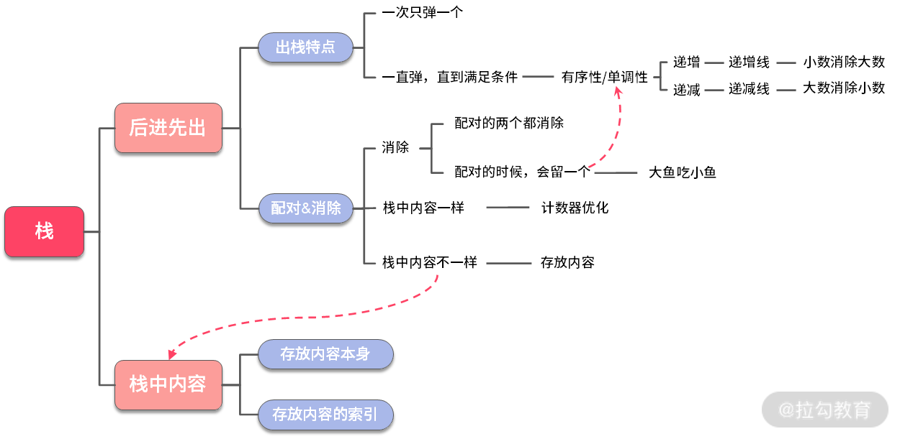

# 解题的一般步骤

1.  模拟：模拟题目的运行(画图辅助分析)。
2.  规律：尝试总结出题目的一般规律和特点。
3.  匹配：找到符合这些特点的数据结构与算法(匹配消除用栈、找相邻最小最大值用单调栈)。
4.  边界：考虑特殊情况(输入参数的判断等)。

[Algorithm-Dryad](https://github.com/lagoueduCol/Algorithm-Dryad)



# 栈

## 判断字符串括号是否合法，字符串中只有字符'('和')'。

1.  使用栈匹配消除（消除一对）
2.  发现入栈只可能是"("，则直接使用单变量计数即可

## 判断字符串括号是否合法，字符串只包括 '('，')'，'{'，'}'，'['，']' 的字符串。

1.  对于多中类型元素，就需要使用栈也可以使用多个变量来分别记录

## 大鱼吃小鱼

1.  使用栈匹配消除（消除小鱼）

```
在水中有许多鱼，可以认为这些鱼停放在 x 轴上。再给定两个数组 Size，Dir，Size[i] 表示第 i 条鱼的大小，Dir[i] 表示鱼的方向 （0 表示向左游，1 表示向右游）。这两个数组分别表示鱼的大小和游动的方向，并且两个数组的长度相等。
所有的鱼都同时开始游动，每次按照鱼的方向，都游动一个单位距离；
当方向相对时，大鱼会吃掉小鱼；
鱼的大小都不一样。
输入：Size = [4, 2, 5, 3, 1], Dir = [1, 1, 0, 0, 0]
输出：3
```

## 单调栈的解题技巧

1.  递增栈，栈元素是递增的（消除，较小数消除较大数）
2.  递减栈，栈元素是递减的（消除，较大数消除较小数）

```
找出数组中右边比我小的元素(递增栈)
【题目】一个整数数组 A，找到每个元素：右边第一个比我小的下标位置，没有则用 -1 表示。
输入：[5, 2]
输出：[1, -1]

数组中右边第一个比我大的元素的位置（递减栈）
数组中元素左边离我最近且比我小的元素的位置(从后往前遍历+递增栈)
数组中元素左边离我最近且比我大的元素的位置(从后往前遍历+递减栈)
```

## 字典序最小的 k 个数的子序列
