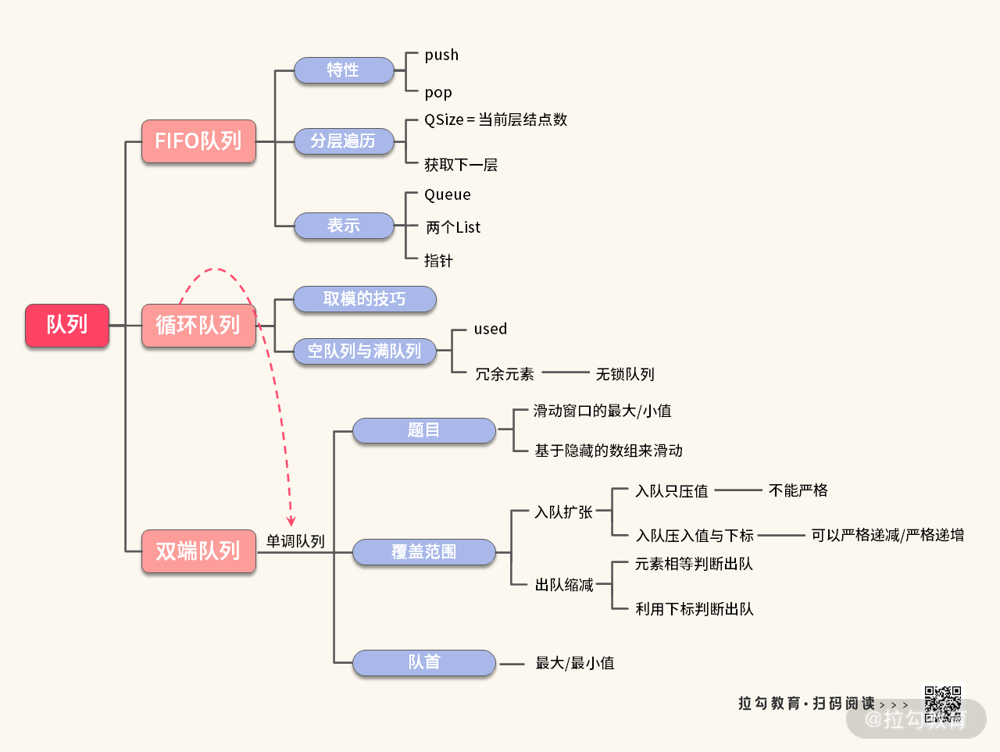
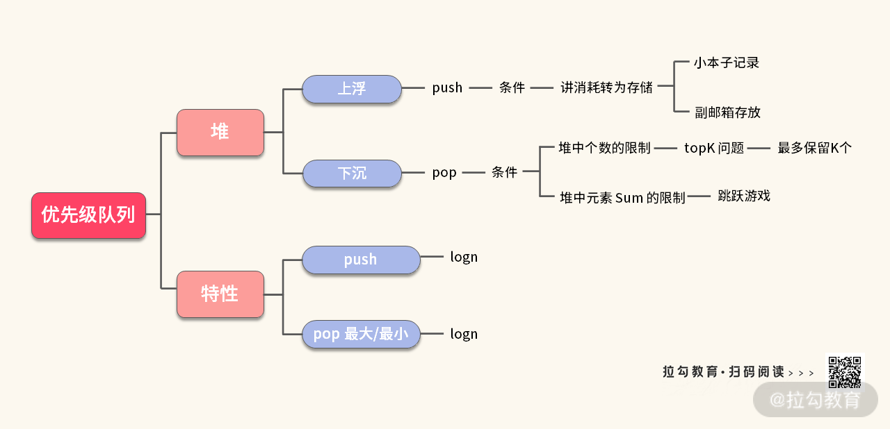
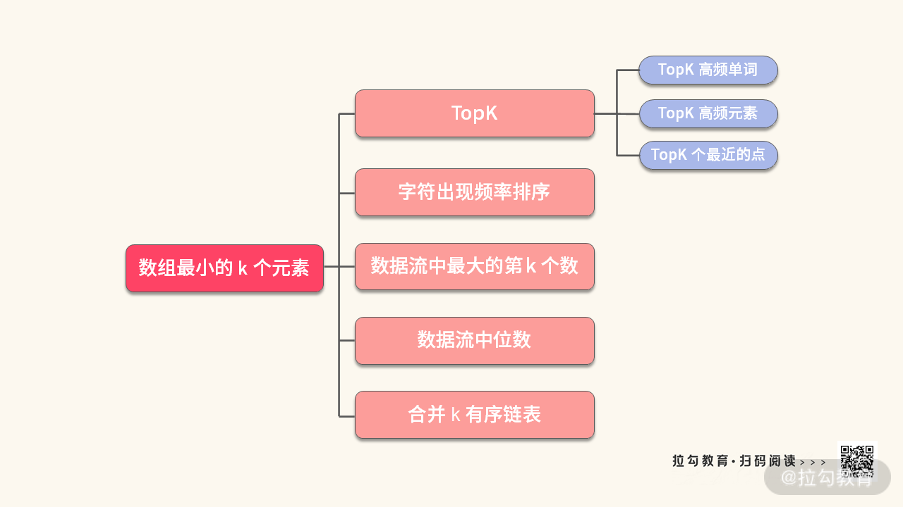

# 解题的一般步骤

1.  模拟：模拟题目的运行(画图辅助分析)。
2.  规律：尝试总结出题目的一般规律和特点。
3.  匹配：找到符合这些特点的数据结构与算法(匹配消除用栈、找相邻最小最大值用单调栈)。
4.  边界：考虑特殊情况(输入参数的判断等)。

[Algorithm-Dryad](https://github.com/lagoueduCol/Algorithm-Dryad)

# 栈

[例子-stack](./stack.js)
## 判断字符串括号是否合法，字符串中只有字符'('和')'。

1.  使用栈匹配消除（消除一对）
2.  发现入栈只可能是"("，则直接使用单变量计数即可

## 判断字符串括号是否合法，字符串只包括 '('，')'，'{'，'}'，'['，']' 的字符串。

1.  对于多中类型元素，就需要使用栈也可以使用多个变量来分别记录

## 大鱼吃小鱼

1.  使用栈匹配消除（消除小鱼）


## 单调栈的解题技巧

1.  递增栈，栈元素是递增的（消除，较小数消除较大数）
2.  递减栈，栈元素是递减的（消除，较大数消除较小数）

## 字典序最小的 k 个数的子序列
1.  给定一个正整数数组和 k，要求依次取出 k 个数，输出其中数组的一个子序列，需要满足：1. 长度为 k；2.字典序最小

##  给定一个数组，数组中的元素代表木板的高度。请你求出相邻木板能剪出的最大矩形面积

# 队列

[例子-queue](./queue.js)
##  二叉树的层次遍历（两种方法）
1.  从上到下按层打印二叉树，同一层结点按从左到右的顺序打印，每一层打印到一行。
##  循环队列
1.  设计一个可以容纳 k 个元素的循环队列
只使用 k 个元素的空间，三个变量 front, rear, used 来控制循环队列的使用

##  双端队列
1.  双端队列可以从首尾两端 push/pop 元素
2.  单调队列属于双端队列的一种（单调递增、单调整递减）

##  单调队列（滑动窗口最大小值）
单调递减队列最重要的特性是：入队与出队的组合，可以在 O(1) 时间得到某个区间上的最大值。
单调递增队列最重要的特性是：入队与出队的组合，可以在 O(1) 时间得到某个区间上的最小值。
入队和出队与普通的队列不一样
```
// 单调递减队列
push(val) {
  while(!queue.isEmpty() && queue.getLast() < val) {
    queue.removeLast();
  }
  queue.addLast(val)
}
pop(val) {
  if(!queue.isEmpty() && queue.getFirst() == val) {
    queue.removeFirst();
  }
}
```

# 堆 && 优先级队列（Priority Queue）


[例子-heap](./heap.js)
##  堆的分类：大堆与小堆
堆的特点：大堆的根是最大值，小堆的根是最小值。
下面都以大堆为例。
##  堆节点index 关系
i 结点的父结点 par = Math.floor((i-1)/2)
i 结点的左子结点 2 * i + 1
i 结点的右子结点 2 * i + 2
##  堆的操作
### 下沉 sink
假设 a[i] 比它的子结点要小，那么除 a[i] 以外，其他子树都满足堆的性质。这个时候，就可以通过下沉操作，帮助 a[i] 找到正确的位置。
### 上浮 swim
假设 a[i] 比它的父结点要大，并且除 a[i] 以外，其他子树都满足大堆的性质。
### push 操作
1.  往堆的尾巴 a[n] 上添加新来的元素
2.  新来元素 a[n] 进行上浮的操作

### pop 操作
1.  取出 a[0] 的值作为返回值
2.  然后将 a[n-1] 存放至 a[0]
3.  将 a[0] 进行下沉操作
