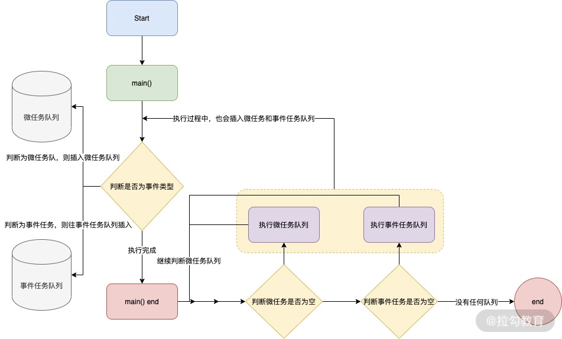
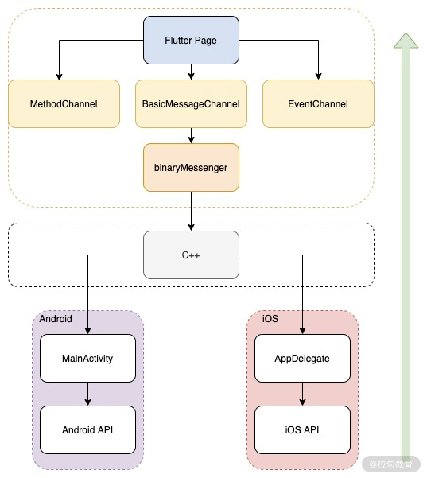
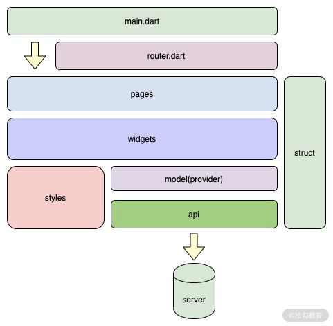

# 基础功能
从 JavaScript 角度来讲解如何学习 Dart。
##  基础数据类型、函数、基础运算符、类、异步原理和文件库引入
### Symbol 的区别
在 Dart 中，Symbol 是不透明的动态字符串名称，用于反映库中的元数据。用 Symbol 可以获得或引用类的一个镜像，概念比较复杂，但其实和 JavaScript 的用法基本上是一致的。
```
void main() {
  Map test = new Map();
  test[#t] = 'symbol test';
  print(test);
  print(test[#t]);
  print(test[Symbol('t')]); // test[#t] 和 test[Symbol('t')] 等价
  print(#t);
}
```
### Undefined 和 Null
由于 Dart 是静态脚本语言，因此在 Dart 中如果没有定义一个变量是无法通过编译的，无 Undefined
null 是弱类型 object 的子类型，并非基础数据类型。所有数据类型，如果被初始化后没有赋值的话都将会被赋值 null 类型。
```
var number;
int num2;
num num1;
double num3;
```
### Map 和 List
Map 和 List 与 JavaScript 中的 Map 和 Array 基本一致，但在 JavaScript 中不是基本数据类型，都属于引用数据类型。因此也就是分类不同，但在用法和类型上基本没有太大差异。
### 弱类型（var、object 和 dynamic）
相对 JavaScript 而言，Dart 也存在弱类型（可以使用 var、object 和 dynamic 来声明），不过在这方面为了避免弱类型导致的客户端（App）Crash 的异常，Dart 还是对弱类型加强了校验。
### 基础运算符
两种语言的基础运算符基本都一致。由于 Dart 是强数据类型，因此在 Dart 中没有 “=== ”的运算符。
Dart 中比较简洁的写法
```
t??'test' 是 t!= null ? t : 'test' 的缩写
级联操作，允许对同一对象或者同一函数进行一系列操作， testObj 对象中有三个方法
testObj.add('t')
..delete('d')
..show()
```
### 函数
在 Dart 中由于是强类型，因此在声明函数的时候可以增加一个返回类型，这点在 TypeScript 中的用法是一致的。
### 类
```
// 命名构造函数
Dart 支持一个类有多个构造函数，并且在实例化的时候可以选择不同的构造函数。
class Dog {
  String color;
  // 1
  Dog.red(){
    this.color = 'red';
  }
  // 2
  Dog.black(){
    this.color = 'black';
  }
}
void main(List<String> args) {
  Dog redDog = new Dog.red();
  print(redDog.color);

  Dog blackDog = new Dog.black();
  print(blackDog.color);
}
// 访问控制
默认情况下都是 public，如果需要设置为私有属性，则在方法或者属性前使用 “_”。
// 抽象类
抽象类和其他语言的抽象类概念一样，主要是实现一个类被用于其他子类继承，抽象类是无法实例化的。
abstract class AggressiveArms {
  attack();
  hurt()；
}
class Gun extends AggressiveArms {
  attack() {
    print("造成100点伤害");
  }
  hurt() {
    print("可以造成100点伤害");
  }
}
// 泛型类
class Array<T> {
  List _list = new List<T>();
  Array();
  void add<T>(T value) {
    this._list.add(value);
  }
  get value{
    return this._list;
  }
}
void main(List<String> args) {
  Array arr = new Array<String>();
  arr.add('aa');
  arr.add('bb');
  print(arr.value);
}
// 库与调用
http://pub.dev/ 类似 npm
pubspec.yaml 类似 package.json
import 'package:startup_namer/pages/homepage.dart';
```
##  事件循环
在 Dart 中同样是单线程执行，其次也包含了两个事件队列，一个是微任务事件队列，一个是事件队列。
```
// 微任务队列
微任务队列包含有 Dart 内部的微任务，主要是通过 scheduleMicrotask 来调度。
// 事件队列
事件队列包含外部事件，例如 I/O 、 Timer ，绘制事件等等。
// 事件循环
首先是执行 main 函数，并生产两个相应的微任务和事件任务队列；
判断是否存在微任务，有则执行，执行完成后再继续判断是否还存在微任务，无则判断是否存在事件任务；
如果没有可执行的微任务，则判断是否存在事件任务，有则执行，无则继续返回判断是否还存在微任务；
在微任务和事件任务执行过程中，同样会产生微任务和事件任务，因此需要再次判断是否需要插入微任务队列和事件任务队列。
// Dart 运行过程中是否会被事件运行卡住?
答案是会，比如在运行某个微任务，该微任务非常的耗时，会导致其他微任务和事件任务卡住，从而影响到一些实际运行
// Isolate 多线程
Dart 的单线程叫作 isolate 线程，每个 isolate 线程之间是不共享内存的，通过消息机制通信。
import 'dart:async';
import 'dart:isolate';
Isolate isolate;
String name = 'dart';
void main() {
	// 执行新线程创建函数
 	isolateServer();
}
/// 多线程函数
void isolateServer()async{
	// 创建新的线程，并且执行回调 changName 
	final receive = ReceivePort();
	isolate = await Isolate.spawn(changName, receive.sendPort);
	// 监听线程返回信息 
	receive.listen((data){
		print("Myname is $data"); // 打印线程返回的数据
		print("Myname is $name"); // 打印全局 name 的数据
	});
}
/// 线程回调处理函数
void changName(SendPort port){
	name = 'dart isloate'; // 修改当前全局 name 属性
	port.send(name); // 将当前name发送给监听方
	print("Myname is $name in isloate"); // 打印当前线程中的 name
}
```

##  规范
```
// 注释文档生成
/// 本模块函数，加载状态类组件HomePageState
class HomePage extends StatefulWidget{
  @override
  createState() => new HomePageState();
}
/// 首页有状态组件类
/// 主要是获取当前时间，并动态展示当前时间
class HomePageState extends State<HomePage> {
  /// 获取当前时间戳
  ///
  /// [prefix]需要传入一个前缀信息
  /// 返回一个字符串类型的前缀信息：时间戳
  String getCurrentTime( String prefix ) {
  }
  /// 有状态类返回组件信息
  @override
  Widget build(BuildContext context) {
  }
}

dartdoc
// 库引入规范
import 'dart:developer';

import 'package:flutter/material.dart';
import 'package:two_you_friend/pages/home_page.dart';

import 'util.dart';
// 代码美化 pritter
dartfmt -h
// 修复当前的代码规范
dartfmt -w --fix lib/ 
https://github.com/dart-lang/dart_style/wiki/Formatting-Rules
// 工具化
在 Dart 中同样存在和 eslint 一样的工具 dartanalyzer 来保证代码质量。
该工具（ dartanalyzer ）已经集成在 Dart SDK ，你只需要在 Dart 项目根目录下新增analysis_options.yaml 文件
https://dart-lang.github.io/linter/lints/
规范模版库 pedantic 和 effective_dart
// 检查代码，提示、警告或者报错信息
dartanalyzer lib // dart analyze lib

// lib下目录建议
在 lib 下创建一个 pages 目录
在 pages 下创建一个类为 home_page.dart 文件;
在 home_page.dart 文件中创建两个类，一个是 HomePage，另一个是 HomePageState；

// main.dart
在 main 函数中引入 home_page.dart 模块，并调用 HomePage 类。
import 'package:two_you_friend/pages/home_page.dart';
```
##  Flutter 生命周期
组件 Widget:无状态组件 StatelessWidget \有状态组件 StatefulWidget
```
// 生命周期(有状态组件)
createState ，该函数为 StatefulWidget 中创建 State 的方法，当 StatefulWidget 被调用时会立即执行 createState 。
initState ，该函数为 State 初始化调用，因此可以在此期间执行 State 各变量的初始赋值，同时也可以在此期间与服务端交互，获取服务端数据后调用 setState 来设置 State。
didChangeDependencies ，该函数是在该组件依赖的 State 发生变化时，这里说的 State 为全局 State ，例如语言或者主题等，类似于前端 Redux 存储的 State 。
build ，主要是返回需要渲染的 Widget ，由于 build 会被调用多次，因此在该函数中只能做返回 Widget 相关逻辑，避免因为执行多次导致状态异常。
reassemble ，主要是提供开发阶段使用，在 debug 模式下，每次热重载都会调用该函数，因此在 debug 阶段可以在此期间增加一些 debug 代码，来检查代码问题。
didUpdateWidget ，该函数主要是在组件重新构建，比如说热重载，父组件发生 build 的情况下，子组件该方法才会被调用，其次该方法调用之后一定会再调用本组件中的 build 方法。
deactivate ，在组件被移除节点后会被调用，如果该组件被移除节点，然后未被插入到其他节点时，则会继续调用 dispose 永久移除。
dispose ，永久移除组件，并释放组件资源。

// 整个过程分为四个阶段
初始化阶段，包括两个生命周期函数 createState 和 initState；
组件创建阶段，也可以称组件出生阶段，包括 didChangeDependencies 和 build；
触发组件多次 build ，这个阶段有可能是因为 didChangeDependencies、setState 或者 didUpdateWidget 而引发的组件重新 build ，在组件运行过程中会多次被触发，这也是优化过程中需要着重需要注意的点；
最后是组件销毁阶段，deactivate 和 dispose。
```

##  基础组建介绍
由于无状态组件在执行过程中只有一个 build 阶段，在执行期间只会执行一个 build 函数，没有其他生命周期函数，因此在执行速度和效率方面比有状态组件更好。
```
// Flutter 中基础组件介绍
Text，文本显示组件，里面包含了文本类相关的样式以及排版相关的配置信息；
Image，图片显示组件，里面包含了图片的来源设置，以及图片的配置；
Icon，Icon 库，里面是 Flutter 原生支持的一些小的 icon ；
FlatButton，包含点击动作的组件；
Row，布局组件，在水平方向上依次排列组件；
Column，布局组件，在垂直方向上依次排列组件；
Container，布局组件，容器组件，这点有点类似于前端中的 body ；
Expanded，可以按比例“扩伸” Row、Column 和 Flex 子组件所占用的空间 ，这点就是前端所介绍的 flex 布局设计；
Padding，可填充空白区域组件，这点和前端的 padding 功能基本一致；
ClipRRect，圆角组件，可以让子组件有圆形边角。
// 单个子元素的布局组件和多个子元素的布局组件
// Single-child
Align 比较好理解，Align 组件的位置左、右、上、下、左上、右下、左下、右上，这两者一般配合 Container 来使用。
Padding 是一个可以设置上下和左右填充的组件，在布局设计中也非常常见。
Expanded 是一个可伸缩的容器，可以根据子组件的大小进行动态伸缩，这个需要配合 Row 组件的 flex 布局使用，其次也可以作为动态列表的父组件，避免列表超出界面，引起布局问题。
Container 是比较常用的，类似一个容器，可以设置容器的大小，然后将子元素包裹在容器中，该组件在超出容器后，会容易引起布局问题。
// Multi-child
Row 是横排展示子组件。
Column 是竖排展示子组件。
Stack 是层叠展示子组件。
```
[内置组建介绍](https://flutterchina.club/widgets/)
##  状态管理
状态管理技术不少于 10 种，介绍其中比较核心的三个，第一个是原生所使用的 InheritedWidget ；第二个是相对前端同学比较熟悉的 Redux 技术；最后一个则是我们推荐使用的技术 Provider 。
```
// Provider（跨页面）
1.  创建状态管理类 name_model ，创建对应的状态 name 以及其修改 name 的方法 changeName；
2.  在 name_game 中增加 provider 的支持，并将相应需要共享的组件使用 provider 进行封装，监听数据变化；
3.  在子组件中获取 provider 的 name 数据以及 changeName 方法，在相应的点击部分触发 changeName 事件。

// InheritedWidget（只能在单个页面内使用）
InheritedWidget 核心原理和状态提升原理一致，只需要在根节点声明即可
1.  首先创建一个根结点为一个有状态组件 name_game；
2.  name_game 为一个有状态类，状态属性为 name，并带有 changName 的状态修改方法；
3.  创建一个状态管理类组件 NameInheritedWidget ；
4.  创建 NameInheritedWidget 的三个子组件，分别为 welcome（显示欢迎 name ）、random_name（显示 name ，并且有点击切换随机 name 操作）和 other_widgets 。

// Redux
层层传递这个 store ，从而会显得代码非常臃肿。
如果需要的 Action 越多，StoreConnector 的层级就越深，你就会陷入深深的代码嵌套中。
```
[Provider 方式](https://github.com/love-flutter/flutter-column/tree/master/07/Provider/lib)
# 项目实战
##  路由设计
router.dart 文件，该文件的作用是实现 App 内的一个路由管理和跳转。
```
// Scheme
Scheme 是一种 App 内跳转协议，通过 Scheme 协议在 APP 内实现一些页面的互相跳转。
[scheme]://[host?]/[path]?[query?] // 不仅 App 内部实现可跳转，还可以适用于外部拉起 App 指定页面的功能

// 内部跳转
tyfapp://userPageIndex?userId=1001
web_view_page.dart 使用第三方库，在遇到 http 或者 https 的协议时，使用该页面去打开
1.  在 router.dart / project_router.dart 导入相应页面组件
2.  在 main.dart 中组册路由: ProjectRouter().registerRouter(),

PS: 判断当前是否有打开页面，如果打开了页面则替换和刷新旧页面，如果没有则打开新的页面。

// 外部跳转
该功能的实现，需要使用 uni_links 第三方库来协助完成外部页面的 Scheme，在 pubspec.yaml 中增加依赖，然后更新本地库文件。
由于 Android 和 iOS 在配置上会有点区别，因此这里分别来介绍。
1.  基础的配置
2.  使用 uni_links 来实现 Scheme 的监听。
Android 流程
android/app/src/main/AndroidManifest.xml
<intent-filter>
    <action android:name="android.intent.action.VIEW"/>
    <category android:name="android.intent.category.DEFAULT"/>
    <category android:name="android.intent.category.BROWSABLE"/>
    <data android:scheme="tyfapp"/> // here
</intent-filter>
iOS 流程
ios/Runner/info.plist
<key>CFBundleURLTypes</key>
<array>
  <dict>
    <key>CFBundleTypeRole</key>
    <string>Editor</string>
    <key>CFBundleURLName</key>
    <string>Two You</string>
    <key>CFBundleURLSchemes</key>
    <array>
      <string>tyfapp</string> // here
    </array>
  </dict>
</array>
问题
当需要被拉起的 App 没有被安装时，这个链接就不会生效；
在大部分 App 内 Scheme 是被禁用的，因此在用户体验的时候会非常差；
注册的 Scheme 相同导致冲突；
Andorid 和 iOS 都提供了一套解决方案，在 Android 叫作 App link / Deep links ，在 iOS 叫作 Universal Links / Custom URL schemes。
```
[更好的外部唤起 app，不管是否有安装](https://kaiwu.lagou.com/course/courseInfo.htm?courseId=251#/detail/pc?id=3527)
##  导航栏定制
三种导航栏功能：底部导航栏、顶部导航栏和侧边导航栏。
[参考](./entrance_bottom_bar.dart)

##  列表样式
ListView，我的
[参考](https://kaiwu.lagou.com/course/courseInfo.htm?courseId=251#/detail/pc?id=3529)

##  下拉刷新上拉加载
下拉刷新：RefreshIndicator
上拉加载更多：ListView.separated 中的 controller 属性
[参考](https://kaiwu.lagou.com/course/courseInfo.htm?courseId=251#/detail/pc?id=3530)

##  服务通信
常见的 APP 网络传输协议序列化方式，XML 、JSON 和 Protocol Buffer。
```
// JSON
import 'dart:convert';  // 数据转化类的原生库
import 'package:dio/dio.dart'; // 网络请求库 
import 'package:two_you_friend/util/tools/json_config.dart'; // 工具库
```

##  打包发布
```
// Android
路径 android/app/src/main/AndroidMainfest.xml 文件
android:label，为应用展示在手机中的名字，这里我们修改为 Two You；
android:icon，为应用展示在手机中的图标，可以修改图片的名字，具体图标文件存储在 android/app/src/main/res 中。
其次需要增加网络访问权限，在 manifest（application 配置下面）中增加下面四行配置
<uses-permission android:name="android.permission.READ_PHONE_STATE" /> 
<uses-permission android:name="android.permission.INTERNET" /> 
<uses-permission android:name="android.permission.ACCESS_NETWORK_STATE" /> 
<uses-permission android:name="android.permission.ACCESS_WIFI_STATE" /> 
// iOS
路径 ios/Runner/info.plist
// name
<key>CFBundleName</key>  
<string>Two You</string> 
// icon 需要根据不同的机型做不同的配置
图标的配置在 ios/Runner/Assets.xcassets/AppIcon.appiconset/Content.json
```
[Android 请参考这里](https://developer.android.com/guide/topics/manifest/manifest-intro.html)
[iOS 请参考这里](https://pub.dev/packages/flutter_permissions)

##  Flutter 本地存储
```
Flutter 本地存储功能包含三种：shared_preferences、path_provider 文件存储以及 sqflite。
// path_provider 三方库
// 如果需要可以放共享 model 中
```
[path_provider](./local_storage.dart)

##  安全保障
sentry 上报 异常 
```
该功能的实现会应用到 FlutterError 和 runZonedGuarded 两个知识点。
在 Flutter 中可以通过 FlutterError 来捕获到运行期间的错误，包括构建期间、布局期间和绘制期间。
runZonedGuarded 则是使用 Zone.fork 创建一片新的区域去运行代码逻辑，也就是 runApp，当遇到错误时会执行其回调函数 onError，其次如果在项目使用了 Zone.current.handleUncaughtError 也会将错误抛出执行 onError 逻辑。
// 引入工具 sentry
void main() {
  AppSentry.runWithCatchError(MyApp());
}
```
[sentry 上报异常代码](./app_sentry.dart)
##  原生通信：应用原生平台交互扩充 Flutter 基础能力
Flutter 是一个跨平台 UI 库，因此不支持原生系统的功能
```
系统通知；
系统感应、相机、电量、LBS、声音、语音识别；
分享、打开其他 App 或者打开自身 App；
设备信息、本地存储。

在 Flutter 中存在三种与原生平台进行交互的方法： MethodChannel 、BasicMessageChannel 和 EventChannel 。
这三者在底层是没有区别的，都是基于 binaryMessenger 来实现。

MethodChannel ，该方法需要创建一个消息通道句柄，然后再利用其中的 invokeMethod 来调用原生平台，原生平台根据传递的方法和参数，执行并获得具体的异步响应结果。该方法支持两个参数，一个是方法名，一个是方法参数，因此更适合去调用原生客户端的函数方法；
BasicMessageChannel ，该方法需要创建一个消息通道句柄，然后再利用其中的 send 方法发送数据给到原生平台.原生平台接收到数据后，可以针对接收数据响应返回，也可以在接收数据后，不做任何返回。因此该方法更适合向原生平台传递数据，而不是功能调用；
EventChannel ，该方法是数据流传递，适用于大文件或者数据流媒体等的应用。发送方不会有响应，但是它会通过调用 MethodChannel 来通知原生平台，比如开始监听数据接收会发送 listen ，取消了数据接收会发送 cancel。
```


##  性能优化：掌握 Flutter 的性能分析和监控

# 其他
```
lib 目录
pages // 页面级（如 user 目录，detail.dart 、 edit.dart）
widgets // comps // 组件(common \ home 等等)
model // 定义公共状态及操作状态的方法（Provider 方式状态管理）
util // struct 数据结构
inherited_widget // 如果使用 InheritedWidget 则需要/状态管理
main.dart // app 配置
router.dart // 路由
api // 服务接口
styles // 公共样式

// 增加依赖后安装
flutter clean
flutter pub upgrade
```

```
入口文件，main.dart 核心入口文件；
pages 作为具体的页面结构，可以通过 main.dart 直接加载，大部分还是通过 router.dart 进行跳转，pages 可以按照业务功能划分文件夹；
pages 下是各个组件组建而成，组件部分可以按照通用、基础和业务来划分；
组件中包含了样式、交互和数据三个部分，因此分别需要 styles 和 model 文件夹；
model 大部分数据来自服务端，因此需要一个 api 文件夹来与服务端交互；
类型校验部分贯穿整个项目，在 pages 、widgets 、 model 和 api 中都可能会被应用到。
```